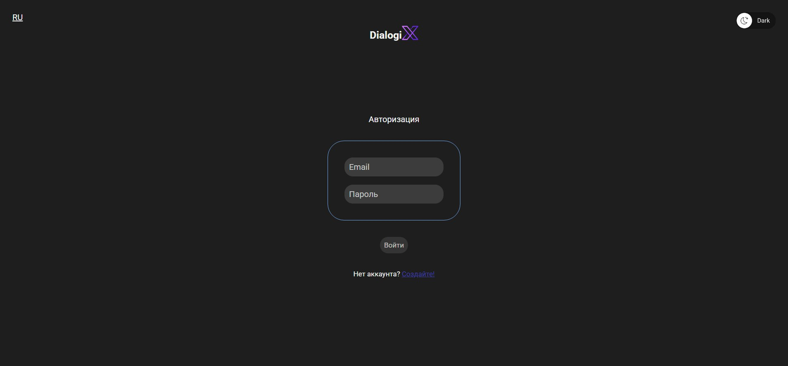
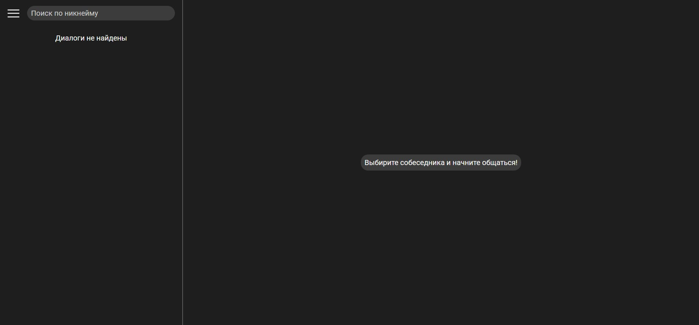
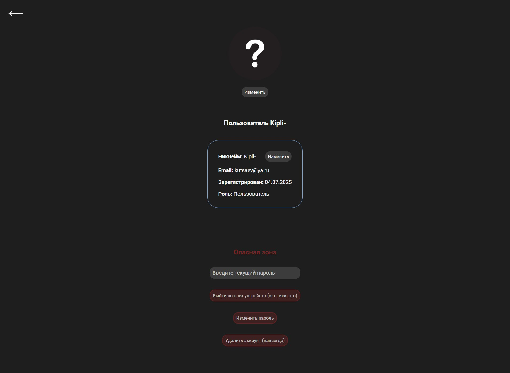
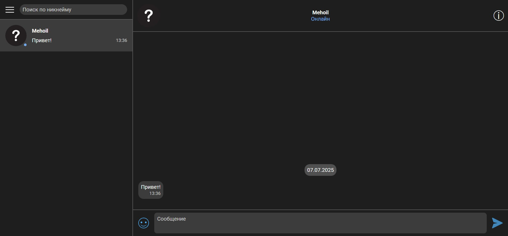
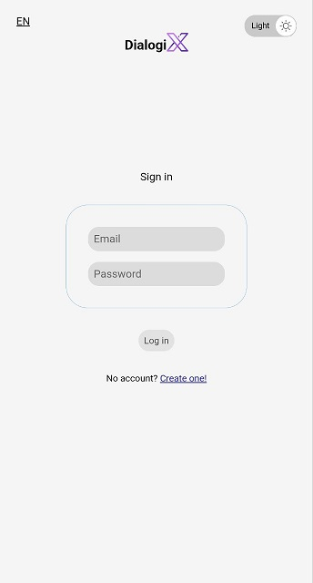
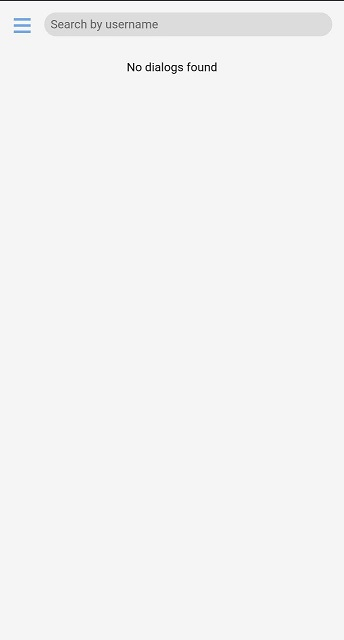
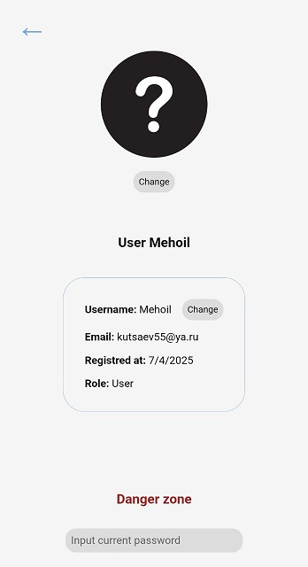
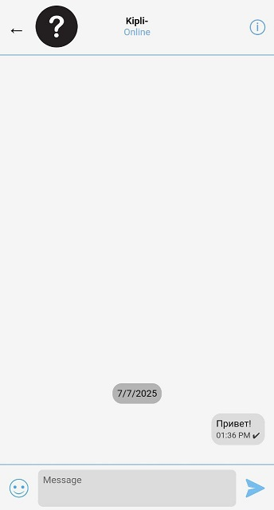

# About

## English  
**DialogiX** is a full-featured web messenger designed for real-time communication.  
The application can be deployed in a container (Docker) or on any hosting platform.  
It supports both **English** and **Russian** languages, **light** and **dark** themes,  
as well as **mobile and desktop devices** with a responsive user interface, including support for **4K displays**.  

## Русский  
**DialogiX** — полнофункциональный веб-мессенджер, разработанный для общения в реальном времени.  
Приложение может быть развернуто в контейнере (Docker) или на любой хостинговой платформе.  
Поддерживаются **русский** и **английский** языки, **светлая** и **тёмная** темы оформления,  
а также **мобильные** и **настольные устройства** благодаря адаптивному интерфейсу с поддержкой **4K-дисплеев**.  
  
# Features

## English  
**DialogiX** offers a comprehensive set of features for real-time messaging and user account management:  
### User Functionality
- User registration, login, and authentication
- Password change
- Logout from all devices
- Account deletion
- Nickname and avatar updates
- Blocking other users

### Messaging
- Sending and receiving messages in real time
- Message editing and deletion
- Chat deletion
  
## Русский  
**DialogiX** предлагает широкий набор функций для обмена сообщениями в реальном времени и управления аккаунтом пользователя:  

### Пользовательский функционал
- Регистрация, вход и аутентификация
- Смена пароля
- Выход со всех устройств
- Удаление аккаунта
- Изменение никнейма и аватара
- Блокировка других пользователей

### Обмен сообщениями
- Отправка и получение сообщений в реальном времени
- Редактирование и удаление сообщений
- Удаление чатов
  
# Get Started

## English  
You will need to generate `CRYPT_IV` in **hex format** with a length of **16** and `CRYPT_KEY` in **hex format** with a length of **32**.  
You will need to create a **login** and **password** for the database.  
You will need to create `ACCESS_TOKEN_SECRET` and `REFRESH_TOKEN_SECRET` — they can be any random strings.  
And after that rename **.env.example** to **.env**  
  
**Command to rebuild from root directory:**  
`docker-compose down; docker volume rm dialogix_frontend_build; docker-compose up --build`  

## Русский  
Вам необходимо сгенерировать `CRYPT_IV` в **hex-формате** длиной **16** символов и `CRYPT_KEY` в **hex-формате** длиной **32** символа.  
Также нужно создать **логин** и **пароль** для базы данных.  
Необходимо создать `ACCESS_TOKEN_SECRET` и `REFRESH_TOKEN_SECRET` — это могут быть любые случайные строки.  
После этого переименуйте **.env.example** в **.env**

**Команда для пересборки из корневой директории проекта:**  
`docker-compose down; docker volume rm dialogix_frontend_build; docker-compose up --build`  

# Screenshots  

## Desktop  

### Login page

  
### Dialogs list page

  
### Profile page

  
### Dialog page

## Mobile  

### Login page

  
### Dialogs list page

  
### Profile page

  
### Dialog page

